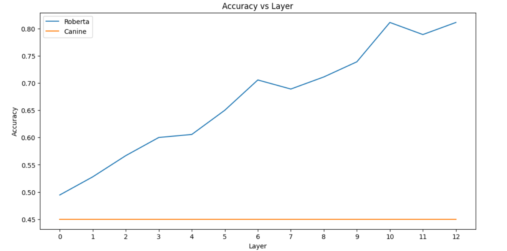

# LM-attacks

# Exploring LM-attacks

This repository has been created as part of the course "Response & Safe AI Systems" at IIIT Hyderabad in Spring 2024 semester. The aim of this project is to explore the vulnerabilities of language models to adversarial attacks. We will be using small language models for this purpose.

### Team Members:
1. Divij
2. Ananth Muppidi
3. Ashutosh Srivastava
4. Praddyumn Shukla
5. Arnav Mago

### Adversarial Attacks:
1. TextFooler
2. DeepWordBug
3. HotFlip

### Language Models:
1. Roberta-Base-SST2
2. LSTM-MR

### Libraries for models and attacks:
1. HuggingFace
2. TextAttack

## Classifiers for detecting attacks
Our first task was to build classifier to detect attacks like TextFooler. We used dataset marked with adversarial examples and trained a classifier on it. We used Roberta-Base-SST2 model for this purpose. The classifier used for this purpose was Bert-base-uncased. The classifier was able to detect adversarial examples with a 66.67% accuracy.

The main purpose of building this classifier for detecting adversarial examples was for comparison (explained in next section)

## Interpretability
We use probing classifiers to analyze the internal represntation of the models while under adversarial attack. We used simple Logistic Regression model to probe. The training data contained 449 examples of adversarial examples and 449 examples of clean examples. The results for this can be seen through the diagram below:

